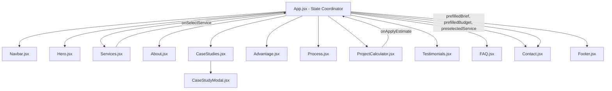

# Elaracode — Project Context & System Documentation

> **Persistent System Documentation** for future AI coding agents and engineering contributors.  
> This file describes the purpose, architecture, stack, state, components, data flows, and build procedures for the Elaracode web platform.

---

## 1. Project Purpose & Domain

- **Name:** Elaracode Digital Systems
- **Repository Corpus:** `MohdAkilAlam/elaracode` (`d:\elara`)
- **Primary Mission:** High-performance digital engineering platform showcasing agency capabilities, case studies, interactive project pricing estimations, and a direct lead-generation intake system.
- **Service Pillars:**
  1. *Web Development:* React & Next.js architectures, headless CMS, Core Web Vitals optimization (<0.6s FCP).
  2. *Organic SEO:* Algorithmic audits, semantic JSON-LD schemas, SERP ranking strategies.
  3. *Digital Marketing:* Performance PPC, full-funnel CRO, server-side tracking (Meta CAPI & GA4).
  4. *UI/UX Architecture:* Tokenized design systems, user journey modeling, micro-interactions.
  5. *GBP Optimization:* Google Business Profile & local Map Pack ranking.
  6. *Cloud IT & Maintenance:* SLA monitoring, security hardening, disaster recovery.
- **Target Audience:** Enterprise founders, CTOs, growth teams, and institutional clients seeking high-velocity engineering without traditional agency bloat.
- **Production Contact:** `elaracode1@gmail.com`

---

## 2. Technology Stack & Key Dependencies

| Layer | Technology | Version | Purpose / Role |
| :--- | :--- | :--- | :--- |
| **Framework / Runtime** | [React](https://react.dev/) | `^19.2.8` | Component rendering, concurrent UI updates |
| **DOM Renderer** | React DOM | `^19.2.8` | Web DOM reconciliation |
| **Build Tooling & Dev Server** | [Vite](https://vite.dev/) | `^8.3.0` | Ultra-fast ESM-based HMR and production Rollup bundling |
| **Compiler Plugin** | `@vitejs/plugin-react` | `^6.1.1` | Fast JSX transformations via Oxc |
| **Linter** | [Oxlint](https://oxc.rs/) | `^1.81.0` | High-speed Rust linter enforcing syntax and React rules |
| **Iconography** | [Lucide React](https://lucide.dev/) + Google Material Symbols | `^1.50.0` (lucide) | Modern vector icons and system symbols |
| **Typography** | Google Fonts | Web Font CDN | `Plus Jakarta Sans` (Display) & `Inter` (Body) |
| **Styling** | Vanilla CSS + CSS Variables | Native | Zero-runtime CSS design token system in `src/index.css` |

---

## 3. Architecture & Application Structure

### 3.1 Architecture Model
- **Pattern:** Single Page Application (SPA) with smooth anchor-based routing (`#services`, `#work`, `#process`, `#about`, `#calculator`, `#reviews`, `#faq`, `#contact`).
- **Rendering Model:** Client-Side Rendering (CSR) bundled to static assets (`dist/`), deployable to any edge CDN (Vercel, Cloudflare Pages, Netlify, AWS S3/CloudFront).
- **Global Theme Engine:** Dual-palette system (`light` and `dark`) controlled via the `data-theme` attribute on `<html>`. Persisted in `localStorage` under key `elara-theme`. Includes an inline blocking script in [index.html](file:///d:/elara/index.html) to prevent flash of unstyled content (FOUC).

### 3.2 Directory Hierarchy
```text
d:\elara\
├── .agents/                      # Agent customizations and skills
│   └── skills/google-stitch/     # UI generation & Stitch integration skill
├── dist/                         # Compiled production bundle output
├── public/                       # Static public assets
│   ├── brand-logo.png            # Master brand logo (high-res)
│   ├── brand-logo-transparent.png# Transparent logo (light theme)
│   ├── brand-logo-dark-transparent.png # Transparent logo (dark theme)
│   ├── favicon.svg               # Browser favicon
│   ├── hero-showcase.jpg         # Hero preview & OpenGraph meta banner
│   ├── icons.svg                 # SVG sprite sheet
│   ├── logo.svg                  # Brand logo vector (light)
│   └── logo-dark.svg             # Brand logo vector (dark)
├── src/                          # Application source code
│   ├── assets/                   # Bundled graphics (hero images)
│   ├── components/               # Modular React UI components
│   │   ├── About.jsx             # Studio narrative, 3 pillars, telemetry badge
│   │   ├── Advantage.jsx         # 4 competitive advantage cards
│   │   ├── CaseStudies.jsx       # Portfolio gallery with category filtering
│   │   ├── CaseStudyModal.jsx    # Deep-dive case study modal dialog
│   │   ├── Contact.jsx           # Intake brief form with FormSubmit & mailto fallback
│   │   ├── FAQ.jsx               # Interactive accordion FAQ
│   │   ├── Footer.jsx            # Multi-column footer & newsletter subscription
│   │   ├── Hero.jsx              # High-impact pitch, live status node, tilt card
│   │   ├── Navbar.jsx            # Fixed frosted header, theme switcher, mobile drawer
│   │   ├── Process.jsx           # 5-stage engineering delivery roadmap
│   │   ├── ProjectCalculator.jsx # Real-time budget & timeline interactive estimator
│   │   ├── Services.jsx          # 6 service capability cards with quote trigger
│   │   ├── SocialIcons.jsx       # Branded social media link cluster
│   │   └── Testimonials.jsx      # Client quotes, star ratings & proof cards
│   ├── data/                     # Static configuration & data arrays
│   │   ├── portfolio.js          # Case study records, metrics, tech stacks
│   │   ├── process.js            # 5 delivery stages & client testimonials
│   │   └── services.js           # 6 core service offerings, pricing & deliverables
│   ├── App.css                   # Supplementary app layout utilities
│   ├── App.jsx                   # Root coordinator: theme state & inter-component sync
│   ├── index.css                 # Master design system tokens & dark mode overrides
│   └── main.jsx                  # React 19 root bootstrap (`createRoot`)
├── docs/                         # Extended persistent documentation
│   ├── architecture.md           # Deep architectural breakdown & token definitions
│   └── api.md                    # External API endpoints & intake integration specs
├── .gitignore                    # Ignored files (node_modules, dist, logs)
├── .oxlintrc.json                # Oxlint rule configuration
├── index.html                    # HTML entry point, SEO meta tags & font preconnects
├── package.json                  # Scripts and package dependencies
├── package-lock.json             # Exact dependency lockfile
├── vite.config.js                # Vite build and plugin setup
├── PROJECT_CONTEXT.md            # This document
├── AGENTS.md                     # Agent conventions and modification guidelines
└── TASK_LOG.md                   # Task history, known issues, and roadmap
```

---

## 4. Key Components & Inter-Component Communication



1. **[App.jsx](file:///d:/elara/src/App.jsx):**
   - Manages top-level `theme` state (`light` / `dark`), persisting to `localStorage`.
   - Manages `selectedService`, `prefilledBrief`, and `prefilledBudget`.
   - Coordinates smooth-scrolling to `#contact` or `#calculator`.
2. **[ProjectCalculator.jsx](file:///d:/elara/src/components/ProjectCalculator.jsx):**
   - Computes estimates based on `projectType`, `scale` (MVP / Growth / Enterprise), `speed` (Standard / Accelerated), and selected add-ons.
   - Pushes calculated summary to [App.jsx](file:///d:/elara/src/App.jsx) via `onApplyEstimate(summary, budgetStr)`.
3. **[Contact.jsx](file:///d:/elara/src/components/Contact.jsx):**
   - Consumes prefilled values, renders multi-select services, custom or banded budget options, and sends leads asynchronously.
4. **[CaseStudies.jsx](file:///d:/elara/src/components/CaseStudies.jsx) & [CaseStudyModal.jsx](file:///d:/elara/src/components/CaseStudyModal.jsx):**
   - Manages category filters (`all`, `web`, `seo`, `marketing`, `local`).
   - Opens modal with challenge, solution, technology stack tags, and quantified business outcomes.

---

## 5. Backend Services, API Endpoints & Database

### 5.1 Backend Services
- **Status:** **None in this repository.** This project is a completely decoupled, static client-side single page application.
- **Hosting:** Static file distribution via CDN/edge storage.

### 5.2 External API Endpoints
- **Lead Generation Endpoint:** `POST https://formsubmit.co/ajax/elaracode1@gmail.com`
  - Handled in [Contact.jsx](file:///d:/elara/src/components/Contact.jsx#L65-L116).
  - Payload:
    ```json
    {
      "_subject": "New Strategic Project Brief from <name>",
      "_template": "table",
      "_captcha": "false",
      "name": "Jane Doe",
      "email": "jane@enterprise.com",
      "budget": "₹50,000 – ₹1,50,000 (Comprehensive Build / Redesign)",
      "services": "Web Development, Organic SEO",
      "brief": "Project scope description..."
    }
    ```
  - **Graceful Fallback:** If the network request fails (ad-blocker, network outage), it falls back to a prefilled `mailto:elaracode1@gmail.com` link.
- **Internal API Endpoints:** None (no server-side routes or GraphQL endpoints).

### 5.3 Database Schema & Persistence
- **Database:** **No server-side database exists.**
- **Client Persistence:**
  - `localStorage.getItem("elara-theme")` / `setItem("elara-theme", theme)`: Persists user preference for `'light'` or `'dark'`.
  - Component form state is ephemeral and lives in React component memory.

### 5.4 Authentication & Authorization
- **Status:** **No authentication required.** The site is fully public. There are no protected user dashboards, session tokens, or JWTs.

---

## 6. Environment Variables

- **Current State:** **No environment variables are currently configured or required.**
- **Verification:** There are no `.env`, `.env.local`, or `.env.example` files in the repository.
- **Future Environment Variable Candidates (Names Only):**
  - `VITE_FORMSUBMIT_EMAIL`: To parameterize the recipient address without hardcoding.
  - `VITE_WHATSAPP_PHONE`: To parameterize the WhatsApp business contact phone.
  - `VITE_GA_TRACKING_ID`: For Google Analytics 4 integration.
  - `VITE_API_BASE_URL`: If a dedicated backend API route or microservice is introduced.

---

## 7. How to Run, Test, and Build

### 7.1 Prerequisites
- Node.js `^18.0.0` or `>= 20.0.0`
- npm `^9.0.0` or `>= 10.0.0`

### 7.2 Commands

```bash
# 1. Install dependencies
npm install

# 2. Start local development server (http://localhost:5173)
npm run dev

# 3. Run Oxlint code verification
npm run lint

# 4. Compile optimized production bundle to /dist
npm run build

# 5. Preview production build locally
npm run preview
```

> **Windows PowerShell Execution Policy Note:** If PowerShell blocks `.ps1` execution scripts, use `npm.cmd`:
> ```powershell
> npm.cmd run dev
> npm.cmd run lint
> npm.cmd run build
> ```

---

## 8. Verified vs. Unverified Areas

### Verified (Directly Inspected in Codebase):
- Full React 19 + Vite 8 setup in [package.json](file:///d:/elara/package.json).
- Design system token hierarchy and dark mode overrides in [src/index.css](file:///d:/elara/src/index.css).
- State and prop synchronization between [App.jsx](file:///d:/elara/src/App.jsx), [ProjectCalculator.jsx](file:///d:/elara/src/components/ProjectCalculator.jsx), and [Contact.jsx](file:///d:/elara/src/components/Contact.jsx).
- FormSubmit.co integration and mailto fallback in [Contact.jsx](file:///d:/elara/src/components/Contact.jsx).
- Clean production build output (`dist/` verified via `vite build` in ~209ms).

### Unverified / Pending User Input:
- **WhatsApp Phone Number:** [Contact.jsx](file:///d:/elara/src/components/Contact.jsx#L262) links to `https://wa.me/` without a phone number parameter.
- **External Email Domain Verification:** FormSubmit.co requires first-time submission activation via confirmation email sent to `elaracode1@gmail.com`.
- **Backend Infrastructure / CMS:** No headless CMS or database is currently wired; all content is stored in static JavaScript files under `src/data/`.
