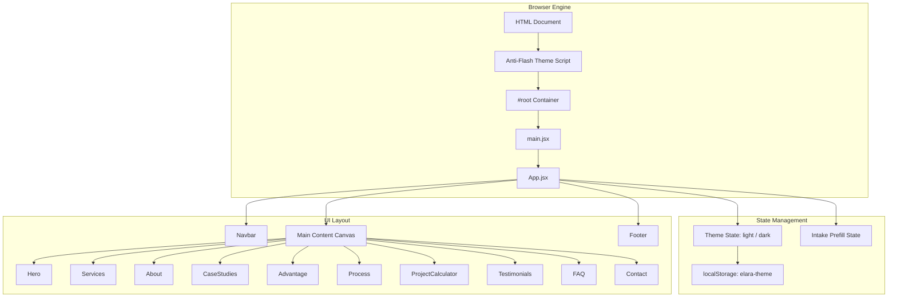

# Elaracode — System Architecture & Design System

> **Technical Architecture Specification**  
> Covers component design, reactive state flow, design tokens, theme implementation, and responsive layout guidelines.

---

## 1. System Architecture

Elaracode is engineered as a zero-bloat, client-side rendered Single Page Application (SPA). Built on **React 19** and bundled with **Vite 8**, it prioritizes sub-second load times (<0.6s FCP), 100/100 Core Web Vitals, and responsive performance without requiring a heavyweight runtime framework.



---

## 2. Component Hierarchy & Responsibilities

| Component | File Path | Primary Function | State / Props |
| :--- | :--- | :--- | :--- |
| **`App`** | [src/App.jsx](file:///d:/elara/src/App.jsx) | Root coordinator; synchronizes theme and intake data | `theme`, `selectedService`, `prefilledBrief`, `prefilledBudget` |
| **`Navbar`** | [src/components/Navbar.jsx](file:///d:/elara/src/components/Navbar.jsx) | Fixed sticky header with blur backdrop, theme button, mobile menu | `theme`, `onToggleTheme`, `onOpenQuote`, `isScrolled`, `mobileMenuOpen` |
| **`Hero`** | [src/components/Hero.jsx](file:///d:/elara/src/components/Hero.jsx) | Hero banner, proof metrics, 3D tilt interaction card | `tilt`, `isHovered` |
| **`Services`** | [src/components/Services.jsx](file:///d:/elara/src/components/Services.jsx) | Service capability grid with deliverables & pricing | `onSelectService` |
| **`About`** | [src/components/About.jsx](file:///d:/elara/src/components/About.jsx) | Studio story, 3 operational pillars, real-time telemetry card | Static data driven |
| **`CaseStudies`** | [src/components/CaseStudies.jsx](file:///d:/elara/src/components/CaseStudies.jsx) | Filterable portfolio cards (`all`, `web`, `seo`, etc.) | `activeFilter`, `selectedStudy` |
| **`CaseStudyModal`** | [src/components/CaseStudyModal.jsx](file:///d:/elara/src/components/CaseStudyModal.jsx) | Full-screen modal overlay for case study details | `study`, `onClose`, `onSelectService` |
| **`Advantage`** | [src/components/Advantage.jsx](file:///d:/elara/src/components/Advantage.jsx) | 4 core architectural value propositions | Static data driven |
| **`Process`** | [src/components/Process.jsx](file:///d:/elara/src/components/Process.jsx) | 5-stage engineering delivery lifecycle | `activeStage` |
| **`ProjectCalculator`** | [src/components/ProjectCalculator.jsx](file:///d:/elara/src/components/ProjectCalculator.jsx) | Interactive budget & timeline estimation matrix | `projectType`, `scale`, `speed`, `addons` |
| **`Testimonials`** | [src/components/Testimonials.jsx](file:///d:/elara/src/components/Testimonials.jsx) | Client reviews with ratings, avatars, and verified badges | Static data driven |
| **`FAQ`** | [src/components/FAQ.jsx](file:///d:/elara/src/components/FAQ.jsx) | Expandable accordion answering commercial questions | `openIndex` |
| **`Contact`** | [src/components/Contact.jsx](file:///d:/elara/src/components/Contact.jsx) | Multi-select service brief, budget selector, async intake | `preselectedService`, `prefilledBrief`, `prefilledBudget` |
| **`Footer`** | [src/components/Footer.jsx](file:///d:/elara/src/components/Footer.jsx) | Capability directory, newsletter subscription form, legal links | `theme`, `email`, `subscribed` |
| **`SocialIcons`** | [src/components/SocialIcons.jsx](file:///d:/elara/src/components/SocialIcons.jsx) | Standardized social channels (X, GitHub, LinkedIn, etc.) | `compact` |

---

## 3. Design System & CSS Token Architecture

All styling is managed through CSS custom properties defined in [src/index.css](file:///d:/elara/src/index.css). No CSS-in-JS or Tailwind compiler is used.

### 3.1 Token Definitions

```css
:root {
  /* Warm Sand & Charcoal Palette (Light) */
  --surface: #f5f0e8;
  --surface-dim: #d6d1c9;
  --surface-bright: #faf7f2;
  --surface-container: #eee9e0;
  
  --on-surface: #1a1a1a;
  --on-surface-variant: #4a4a4a;
  
  --primary: #1a1a1a;
  --primary-yellow: #ffcc00;
  --primary-yellow-hover: #f5c400;
  
  --secondary: #e63b2e;
  --secondary-container: #ffdad6;
  
  --tertiary: #0055ff;
  --tertiary-container: #d6e3ff;
  
  --outline: #1a1a1a;
  
  --font-display: 'Plus Jakarta Sans', system-ui, sans-serif;
  --font-body: 'Inter', system-ui, sans-serif;
  
  --radius-sm: 0.25rem;
  --radius-md: 0.375rem;
  --radius-lg: 0.5rem;
  
  --shadow-sm: 2px 2px 0px #1a1a1a;
  --shadow-md: 4px 4px 0px #1a1a1a;
  --shadow-lg: 6px 6px 0px #1a1a1a;
}

[data-theme="dark"] {
  /* Slate & Carbon Palette (Dark) */
  --surface: #0c0c0e;
  --surface-dim: #141418;
  --surface-bright: #1c1c22;
  --surface-container: #141418;
  
  --on-surface: #f0ede6;
  --on-surface-variant: #a09d96;
  
  --primary: #ffcc00;
  --outline: #2a2a32;
  --shadow-sm: 2px 2px 0px rgba(0, 0, 0, 0.6);
  --shadow-md: 4px 4px 0px rgba(0, 0, 0, 0.6);
}
```

### 3.2 Anti-Flash Theme Bootstrapping
To eliminate the flash of white/light background when loading in dark mode:
1. An inline `<script>` tag executes synchronously in `<head>` before the DOM renders in [index.html](file:///d:/elara/index.html).
2. It reads `localStorage.getItem('elara-theme')` or system `window.matchMedia('(prefers-color-scheme: dark)')`.
3. It sets `document.documentElement.setAttribute('data-theme', theme)`.

---

## 4. Responsive Layout Strategy

- **Breakpoints:** Handled via CSS media queries (`max-width: 768px` for mobile viewports, `min-width: 1024px` for desktop grids).
- **Fluid Layouts:** Uses CSS Grid with `repeat(auto-fit, minmax(320px, 1fr))` ensuring smooth wrapping across phones, tablets, and wide monitors.
- **Fluid Typography:** Uses `clamp()` for section headlines (e.g., `fontSize: clamp(2rem, 3.5vw, 2.75rem)`).
